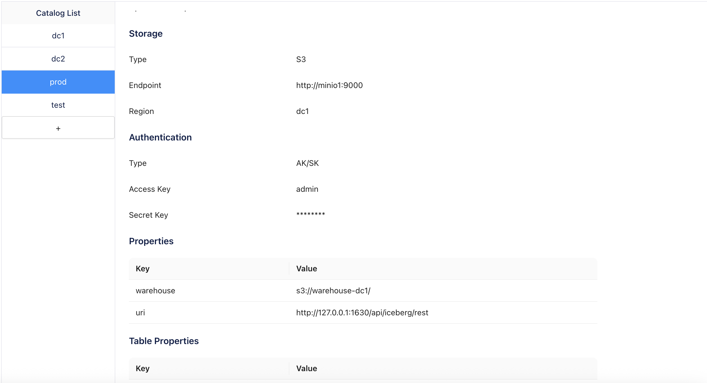

# DataDependency Module Deploy Guide

## Overview

The DataDependency module provides data-aware scheduling capabilities for Volcano Global, enabling workloads to be scheduled based on data locality and availability. This module consists of two main components:

- **DataSourceClaim (DSC)**: A request for data sources by workloads
- **DataSource (DS)**: Represents a cache of DSC requests

## Architecture

The DataDependency module works by:

1. **Data Discovery**: Plugins query external data systems to discover available data sources
2. **Dynamic Binding**: DataSourceClaims are automatically bound to appropriate DataSources
3. **Locality-Aware Scheduling**: Workloads are scheduled to clusters where data is available
## Prerequisites

Before deploying the DataDependency module, ensure you have:

1. **Volcano Global** deployed and running (see main [Deploy Guide](README.md))
2. **Karmada** control plane with worker clusters
3. **External data systems** (e.g., Amoro, HDFS) that you want to integrate
4. **Network connectivity** between Volcano Global and external data systems

## Deployment Steps

### 1. Deploy DataDependency CRDs

First, apply the Custom Resource Definitions for DataDependency:

```bash
# Switch to Karmada host kubeconfig
export KUBECONFIG=$HOME/.kube/karmada.config

# Apply DataDependency CRDs
kubectl --context karmada-apiserver apply -f docs/deploy/crds/datadependency.volcano.sh_datasourceclaims.yaml
kubectl --context karmada-apiserver apply -f docs/deploy/crds/datadependency.volcano.sh_datasources.yaml
```

### 2. Configure DataSource Plugins

Configure plugins for your external data systems by editing the plugin ConfigMap:

```bash
# Apply the default plugin configuration
kubectl --context karmada-host apply -f docs/deploy/volcano-global-datasource-plugins-configmap.yaml
```

**Important**: You must customize the plugin configuration according to your environment. Edit the ConfigMap to match your actual data systems:

```yaml
apiVersion: v1
kind: ConfigMap
metadata:
  name: volcano-global-datasource-plugins
  namespace: volcano-global
data:
  amoro: |
    {
      "system": "amoro",
      "endpoint": {
        "url": "http://your-amoro-server.com",  # Replace with your Amoro server URL
        "port": 1630
      },
      "locationMapping": {
        "s3://your-warehouse-dc1/": ["cluster1", "cluster2"],  # Map data locations to clusters
        "s3://your-warehouse-dc2/": ["cluster3"]
      },
      "retryConfig": {
        "maxRetries": 3,
        "initialBackoff": "1s",
        "maxBackoff": "30s",
        "backoffMultiplier": 2.0,
        "timeout": "30s"
      }
    }
```

### 3. Enable DataDependency Components

To enable complete data-aware capabilities, you need to enable **both** components:

1. **DataDependency Controller** - Manages DataSourceClaim lifecycle and ResourceBinding updates
2. **Dispatcher DataDependency Features** - Enables data-aware scheduling in the dispatcher

#### 3.1 Enable DataDependency Controller

Add `datadependency-controller` to the controllers list:

```yaml
args:
  - --controllers=dispatcher,datadependency-controller
```

#### 3.2 Enable Dispatcher DataDependency Features

Enable the `DataDependencyAwareness` feature gate:

```yaml
args:
  - --feature-gates=DataDependencyAwareness=true
```

#### 3.3 Mount Plugin Configuration

2) Mount the plugin ConfigMap and set the plugin path environment variable:

```yaml
env:
  - name: PLUGIN_CONFIG_PATH
    value: "/etc/volcano-global/plugins"
volumeMounts:
  - name: plugin-config
    mountPath: /etc/volcano-global/plugins
    readOnly: true
volumes:
  - name: plugin-config
    configMap:
      name: volcano-global-datasource-plugins
```

The following is a complete yaml file example that has been configured:

```yaml
kind: Deployment
apiVersion: apps/v1
metadata:
  name: volcano-global-controller-manager
  namespace: volcano-global
spec:
  replicas: 1
  selector:
    matchLabels:
      app: volcano-global-controller-manager
  template:
    metadata:
      labels:
        app: volcano-global-controller-manager
    spec:
      automountServiceAccountToken: false
      containers:
        - name: volcano-global-controllers-manager
          image: volcano-global-controller-manager:test
          args:
            - --kubeconfig=/etc/kubeconfig/karmada.config
            - --leader-elect=false
            - --leader-elect-resource-namespace=volcano-global
            - --logtostderr
            - --enable-healthz=true
            - --dispatch-period=1s
            # - --controllers=dispatcher
            # Uncomment the following lines to enable DataDependency features
            - --controllers=dispatcher,datadependency-controller
            - --feature-gates=DataDependencyAwareness=true
            - -v=5
            - 2>&1
          imagePullPolicy: IfNotPresent
          env:
            - name: PLUGIN_CONFIG_PATH
              value: "/etc/volcano-global/plugins"
          volumeMounts:
            - name: webhook-config
              mountPath: /etc/kubeconfig
              readOnly: true
            - name: plugin-config
              mountPath: /etc/volcano-global/plugins
              readOnly: true
      volumes:
        - name: webhook-config
          secret:
            secretName: karmada-webhook-config
        - name: plugin-config
          configMap:
            name: volcano-global-datasource-plugins
```

### 4. Verify DataDependency Controller

Ensure the DataDependency controller is running as part of the Volcano Global controller manager:

```bash
# Check controller manager status
kubectl --context karmada-host get pods -n volcano-global -l app=volcano-global-controller-manager

# Check controller logs for DataDependency
kubectl --context karmada-host logs -n volcano-global -l app=volcano-global-controller-manager | grep -i datadependency
```

## Usage Examples

> **⚠️ Important: Creation Order Requirements**
> 
> For proper data dependency scheduling to work, you **MUST** follow this creation order:
> 
> 1. **First**: Create the DataSourceClaim (DSC)
> 2. **Then**: Create the workload (Deployment, Job, etc.) and PropagationPolicy
> 
> **What happens if you create workload first?**
> - If you create PropagationPolicy and workload before the DataSourceClaim, the initial ResourceBinding will be generated without data locality information
> - The DataDependency Controller will not be able to inject data location constraints into an already-created ResourceBinding
> - Your workload may be scheduled to clusters that don't have access to the required data, leading to runtime failures
> - You would need to delete and recreate the PropagationPolicy to trigger a new ResourceBinding with proper data locality constraints
> 
> **Recommended workflow:**
> ```bash
> # 1. Create DataSourceClaim first
> kubectl apply -f datasourceclaim.yaml
> 
> # 2. Then create workload and PropagationPolicy
> kubectl apply -f workload.yaml
> kubectl apply -f propagationpolicy.yaml
> ```

### Example 1: Basic DataSourceClaim

Create a DataSourceClaim that requests access to a specific data source:

```yaml
apiVersion: datadependency.volcano.sh/v1alpha1
kind: DataSourceClaim
metadata:
  name: dsc-dynamic-binding-test
  namespace: default
spec:
  # Required: underlying data system
  system: "amoro"
  # Required: category of the data source within the system
  dataSourceType: "table"
  # Required: logical name of the data source to claim
  dataSourceName: "prod.db.user"
  # Required: workload that this claim is associated with
  workload:
    apiVersion: "apps/v1"
    kind: "Deployment"
    name: "test-app"
    namespace: "default"
```

### Example 2: Workload with DataDependency

Deploy a workload that depends on data:

```yaml
apiVersion: apps/v1
kind: Deployment
metadata:
  name: test-app
  labels:
    app: test-app
spec:
  replicas: 1
  selector:
    matchLabels:
      app: test-app
  template:
    metadata:
      labels:
        app: test-app
    spec:
      containers:
      - image: nginx
        name: nginx
```

### Example 3: ResourceBinding for Data-Aware Scheduling

Create a PropagationPolicy to select the target workload; the controller will modify the generated ResourceBinding with data locality information to enforce data-aware scheduling.

Note: The controller does not update the PropagationPolicy itself. It updates the ResourceBinding (derived from the PropagationPolicy) to reflect cluster locality and placement.

```yaml
apiVersion: policy.karmada.io/v1alpha1
kind: PropagationPolicy
metadata:
  name: test-app
  namespace: default
spec:
  # Select DataSourceClaim resources
  resourceSelectors:
    - apiVersion: apps/v1
      kind: Deployment
      name: test-app
  # Propagate to specified clusters
  placement:
    clusterAffinity:
      clusterNames:
    # Replica scheduling strategy
    replicaScheduling:
      replicaDivisionPreference: Aggregated
      replicaSchedulingType: Divided

```

## Complete Example Deployment

Deploy the complete example from the repository following the correct order:

```bash
# Switch to Karmada host kubeconfig
export KUBECONFIG=$HOME/.kube/karmada.config

# Step 1: Create DataSourceClaim first (REQUIRED ORDER)
kubectl --context karmada-apiserver apply -f docs/deploy/example/datadependency/dsc-dynamic-binding.yaml

# Step 2: Create the workload and PropagationPolicy
kubectl --context karmada-apiserver apply -f docs/deploy/example/datadependency/deployment-dynamic-binding.yaml
kubectl --context karmada-apiserver apply -f docs/deploy/example/datadependency/pp-dynamic-binding.yaml

# Optional: Apply plugin configuration if not already done
kubectl --context karmada-apiserver apply -f docs/deploy/example/datadependency/amoro-plugin-config.yaml
```

This will create:
- A DataSourceClaim requesting access to `dc1.db.user` table
- A test Deployment with matching labels  
- A PropagationPolicy for the deployment

> **Note**: The order is critical - DataSourceClaim must be created before the workload and PropagationPolicy to ensure proper data locality injection.

## Monitoring and Troubleshooting

### Check DataSourceClaim Status

```bash
# List all DataSourceClaims
kubectl --context karmada-apiserver get datasourceclaims

# Get detailed status of a specific claim
kubectl --context karmada-apiserver describe datasourceclaim my-data-claim
```

### Check DataSource Status

```bash
# List all DataSources (cluster-scoped)
kubectl --context karmada-apiserver get datasources

# Get detailed information about a DataSource
kubectl --context karmada-apiserver describe datasource <datasource-name>
```

### Common Status Values

- **DataSourceClaim Status**:
  - `Pending`: Waiting for plugin to discover matching data source
  - `Bound`: Successfully bound to a DataSource
  - `Failed`: Unable to find or bind to a data source

- **DataSource Status**:
  - `Available`: Data source is accessible and ready
  - `Unavailable`: Data source is not accessible (e.g., 404 error)

### Troubleshooting Common Issues

1. **DataSourceClaim stuck in Pending**:
   - Check plugin configuration in ConfigMap
   - Verify external data system connectivity
   - Check controller logs for plugin errors

2. **DataSource shows as Unavailable**:
   - Verify external data system is running
   - Check network connectivity
   - Review plugin endpoint configuration

3. **Workload not scheduled to expected clusters**:
   - Verify PropagationPolicy is correctly configured
   - Check DataSource cluster locality information
   - Ensure webhook manager is running

### Viewing Logs

```bash
# Controller manager logs
kubectl --context karmada-host logs -n volcano-global -l app=volcano-global-controller-manager -f

# Filter for DataDependency-specific logs
kubectl --context karmada-host logs -n volcano-global -l app=volcano-global-controller-manager | grep -v 'session\.go' | grep -v 'dispatcher\.go' | grep -v 'capacity\.go' | grep -v 'reflector\.go' | grep -v 'plugin_manager\.go' | grep -v 'amoro\.go'
```

## Amoro Test Environment Configuration

This section describes the specific configuration for our Amoro test environment and explains how the data discovery mechanism works.

### Test Environment Setup

Our test environment uses the following Amoro configuration:



```yaml
apiVersion: v1
kind: ConfigMap
metadata:
  name: volcano-global-datasource-plugins
  namespace: volcano-global
data:
  amoro: |
    {
      "system": "amoro",
      "endpoint": {
        "url": "http://your-amoro-server.com",  # Replace with your Amoro server URL
        "port": 1630
      },
      "locationMapping": {
        "s3://your-warehouse-dc1/": ["cluster1", "cluster2"],  # Map data locations to clusters
        "s3://your-warehouse-dc2/": ["cluster3"]
      },
      "retryConfig": {
        "maxRetries": 3,
        "initialBackoff": "1s",
        "maxBackoff": "30s",
        "backoffMultiplier": 2.0,
        "timeout": "30s"
      }
    }
```

### Data Discovery Mechanism

The Amoro plugin performs data discovery by making HTTP GET requests to the Amoro REST API. Here's how it works:

#### 1. Table Discovery Query

When a DataSourceClaim requests access to a table (e.g., `dc1.db.user`), the plugin constructs a REST API call:

```
GET http://amoro-server.test.com:1630/api/iceberg/rest/v1/catalogs/dc1/namespaces/db/tables/user
```

**Query Breakdown:**
- **Base URL**: `http://amoro-server.test.com:1630/api/iceberg/rest/v1`
- **Catalog**: `dc1` (extracted from the dataSourceName)
- **Namespace**: `db` (extracted from the dataSourceName)
- **Table**: `user` (extracted from the dataSourceName)

#### 2. Response Processing

The Amoro server returns table metadata including:

```json
{
  "metadata-location": "s3://your-warehouse-dc1/db/user/metadata/v00821-77a4589a-03d6-4aad-bd73-fb4a24a86137.metadata.json",
  "metadata": {
    "format-version": 2,
    "table-uuid": "762a7ea5-dea1-496a-8319-73e42c5921dc",
    "location": "s3://your-warehouse-dc1/db/user",
    "last-sequence-number": 1,
    "last-updated-ms": 1758777963300,
    "properties": {
      "owner": "root",
      "write.parquet.compression-codec": "zstd"
    }
  },
  "config": {}
}
```

#### 3. Location Mapping

The plugin extracts the `metadata.location` field (`s3://your-warehouse-dc1/db/user`) and matches it against the `locationMapping` configuration:

- **Location**: `s3://your-warehouse-dc1/` → **Clusters**: `["cluster1", "cluster2"]`
- **Location**: `s3://your-warehouse-dc2/` → **Clusters**: `["cluster3"]`

#### 4. DataSource Creation

Based on the location mapping, the plugin creates a DataSource resource:

```yaml
apiVersion: datadependency.volcano.sh/v1alpha1
kind: DataSource
metadata:
  name: amoro-dc1-db-user
spec:
  system: "amoro"
  dataSourceType: "table"
  dataSourceName: "dc1.db.user"
  location: "s3://your-warehouse-dc1/db/user"
  clusters: ["cluster1", "cluster2"]
  status: "Available"
```

### Test Data Examples

Our test environment includes the following sample tables:

| DataSourceName | Location | Available Clusters |
|----------------|----------|-------------------|
| `dc1.db.user` | `s3://your-warehouse-dc1/db/user` | cluster1, cluster2 |
| `dc1.db.order` | `s3://your-warehouse-dc1/db/order` | cluster1, cluster2 |
| `dc2.analytics.metrics` | `s3://your-warehouse-dc2/analytics/metrics` | cluster3 |

### Query Verification

You can verify the Amoro plugin's query mechanism by manually testing the REST API:

```bash
# Test table discovery
curl -s "http://amoro-server.test.com:1630/api/iceberg/rest/v1/catalogs/dc1/namespaces/db/tables/user"

# Expected response should include location information# Expected response:
# {
#   "metadata-location": "s3://your-warehouse-dc1/db/user/metadata/v00821-77a4589a-03d6-4aad-bd73-fb4a24a86137.metadata.json",
#   "metadata": {
#     "location": "s3://your-warehouse-dc1/db/user",
#     ...
#   }
# }
```

### Troubleshooting Amoro Integration

1. **Connection Issues**:
   ```bash
   # Test connectivity to Amoro server
   curl -v http://amoro-server.test.com:1630/api/v1/health
   ```

2. **Table Not Found (404)**:
   - Verify the table exists in Amoro catalog
   - Check the dataSourceName format: `catalog.namespace.table`
   - Ensure the catalog, namespace, and table names are correct

3. **Location Mapping Issues**:
   - Verify the location returned by Amoro matches your locationMapping prefixes
   - Check that the S3 paths in locationMapping are correctly configured
   - Ensure cluster names in locationMapping match your actual cluster names

## Plugin Development

To integrate with additional data systems, you can develop custom plugins. The plugin interface requires implementing:

1. **Discovery**: Query external systems for available data sources
2. **Selection**: Determine which clusters have access to specific data
3. **Health Check**: Monitor plugin and external system health

Refer to the existing Amoro plugin implementation in the codebase for examples.

## Security Considerations

1. **Credentials**: Store sensitive credentials (API keys, passwords) in Kubernetes Secrets
2. **Network Security**: Ensure secure communication with external data systems
3. **RBAC**: Configure appropriate Role-Based Access Control for DataDependency resources
4. **Plugin Security**: Validate plugin configurations and sanitize inputs

## Performance Tuning

1. **Plugin Update Interval**: Adjust the plugin update interval based on your data change frequency
2. **Retry Configuration**: Tune retry settings for external system calls
3. **Resource Limits**: Set appropriate resource limits for controller and webhook managers

## Next Steps

After successfully deploying the DataDependency module:

1. **Monitor** your data-aware workloads and their scheduling behavior
2. **Optimize** plugin configurations based on your data access patterns
3. **Scale** by adding more data systems and plugins as needed
4. **Integrate** with your CI/CD pipelines for automated data-aware deployments
