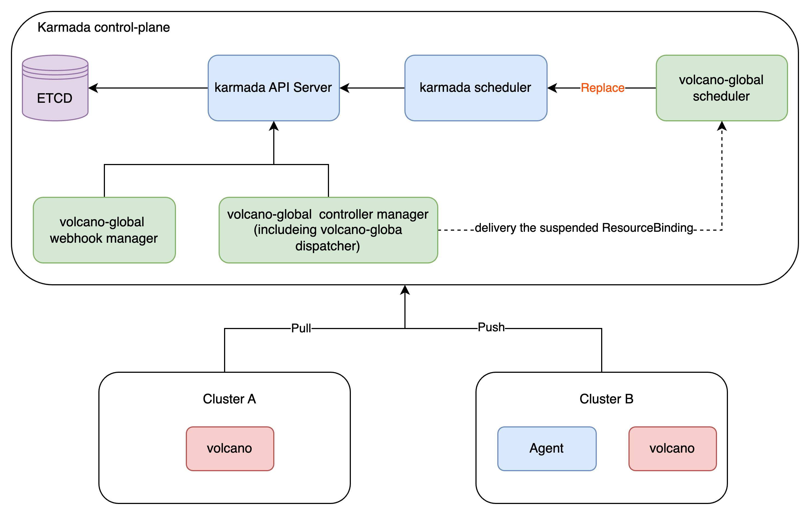

# Deploy `Volcano-global` Guide

# The Structure of the whole multi-cluster



`Volcano-global` is deployed on the basis of `Karmada`. After deploying
`Karmada`, you need to deploy [`Volcano`](https://github.com/volcano-sh/volcano)
on the worker cluster and deploy three components of `Volcano-global` in the `Karmada control plane`.

The scheduler of `volcano-global` is customized based on the extension points of the `Karmada scheduler`.
Compared to the `Karmada Scheduler`, it provides the capability to schedule AI jobs,
as well as handles scenarios involving **single/multiple template tasks**.
Additionally, it can perform all the functions that the `Karmada scheduler` is capable of, **ensuring compatibility**.
And it needs to **replace the `Karmada scheduler`**.

This installation document will provide examples based on deploying `Karmada` using `./hack/local-up-karmada.sh`.
You can modify the deployment method according to different environments.

# Deploy Steps

## 1. Deploy the Karmada

Suggest `Karmada` Version: **1.10**

Follow the [karmada get started guide](https://karmada.io/docs/get-started/nginx-example) to deploy `Karmada`.

Currently, `Karmada` does not support the suspend capability for `ResourceBinding`.
You need to fork this branch to deploy it.

https://github.com/Vacant2333/karmada/tree/add-suspend-field-for-resourcebinding

```bash
# Clone the target branch
git clone -b add-suspend-field-for-resourcebinding https://github.com/Vacant2333/karmada.git

cd karmada

# Deploy the karmada environment
./hack/local-up-karmada.sh
```

## 2. Deploy the Volcano to member clusters

Suggest `Volcano` Version: **1.10.0**

Follow the [volcano installation guide](https://volcano.sh/en/docs/v1-9-0/installation/) to deploy `Volcano` to the member clusters.

You can install `Volcano` to all member cluster like:

```bash
# Switch to the member clusters, you need install the Volcano to the all member cluster.
export KUBECONFIG=/Users/vacant/.kube/members.config

# Deploy Volcano to the member clusters.
kubectl --context member1 apply -f https://raw.githubusercontent.com/volcano-sh/volcano/release-1.10/installer/volcano-development.yaml
kubectl --context member2 apply -f https://raw.githubusercontent.com/volcano-sh/volcano/release-1.10/installer/volcano-development.yaml
kubectl --context member3 apply -f https://raw.githubusercontent.com/volcano-sh/volcano/release-1.10/installer/volcano-development.yaml
```

## 3. Deploy the `Kubernetes Reflector` to share the Karmada's kubeconfig secret to volcano-global namespace

The `Karmada control plane` is a standalone apiserver,
so we need the kubeconfig secret in the `karmada-system` to access it.
However, since secrets are namespace-scoped resources,
we need a plugin to share the target secret with the `volcano-global` namespace.

```bash
# Switch to Karmada host kubeconfig.
export KUBECONFIG=/Users/vacant/.kube/karmada.config

# Deploy the Kubernetes Reflector and share the kubeconfig from karmada-system namespace.
kubectl --context karmada-host -n kube-system apply -f https://github.com/emberstack/kubernetes-reflector/releases/download/v7.1.262/reflector.yaml
kubectl --context karmada-host annotate secret kubeconfig \
  reflector.v1.k8s.emberstack.com/reflection-allowed="true" \
  reflector.v1.k8s.emberstack.com/reflection-auto-namespaces="volcano-global" \
  reflector.v1.k8s.emberstack.com/reflection-auto-enabled="true" \
  --namespace=karmada-system
```

## 4. Deploy the volcano-global controller and webhook manager at Karmada control plane cluster

You need to build the images on the root direction of the project.

```bash
# Build the components.
TAG=1.0 make images

# Load the image to karmada host cluster.
kind load docker-image --name karmada-host volcanosh/volcano-global-scheduler:1.0
kind load docker-image --name karmada-host volcanosh/volcano-global-controller-manager:1.0
kind load docker-image --name karmada-host volcanosh/volcano-global-webhook-manager:1.0
```

You need to run these commands on `docs/deploy` direction.

```bash
# Switch to Karmada host kubeconfig.
export KUBECONFIG=/Users/vacant/.kube/karmada.config

# Apply the component deployment yaml.
kubectl --context karmada-host apply -f volcano-global-namespace.yaml
kubectl --context karmada-host apply -f volcano-global-controller-manager.yaml
kubectl --context karmada-host apply -f volcano-global-webhook-manager.yaml

# Apply the webhook configuration.
kubectl --context karmada-apiserver apply -f volcano-global-webhooks.yaml
```

## 5. Deploy the volcano-global scheduler to replace karmada scheduler at Karmada control plane cluster

```bash
# Switch to Karmada host kubeconfig.
export KUBECONFIG=/Users/vacant/.kube/karmada.config

# Update the karmada scheduler image.
kubectl --context karmada-host set image deployment/karmada-scheduler \
  karmada-scheduler=volcanosh/volcano-global-scheduler:1.0 \
  -n karmada-system
```

## 6. Apply the required CRD at Karmada control plane

In addition to using `Karmada` CRDs, `volcano-global` also requires
the introduction of some `Volcano` CRDs to enable the **queue capability** for the `volcano-global dispatcher`.

Required `Volcano` CRD List:
- batch.volcano.sh_jobs
- scheduling.volcano.sh_podgroups
- scheduling.volcano.sh_queues
- bus.volcano.sh_commands

```bash
# Switch to Karmada host kubeconfig.
export KUBECONFIG=/Users/vacant/.kube/karmada.config

# Apply the required CRD to Karmada control plane.
kubectl --context karmada-apiserver apply -f https://github.com/volcano-sh/volcano/raw/release-1.10/installer/helm/chart/volcano/crd/bases/batch.volcano.sh_jobs.yaml
kubectl --context karmada-apiserver apply -f https://github.com/volcano-sh/volcano/raw/release-1.10/installer/helm/chart/volcano/crd/bases/scheduling.volcano.sh_podgroups.yaml
kubectl --context karmada-apiserver apply -f https://github.com/volcano-sh/volcano/raw/release-1.10/installer/helm/chart/volcano/crd/bases/scheduling.volcano.sh_queues.yaml
kubectl --context karmada-apiserver apply -f https://github.com/volcano-sh/volcano/raw/release-1.10/installer/helm/chart/volcano/crd/bases/bus.volcano.sh_commands.yaml
```

## 7. Apply the custom volcano job resource interpreter at Karmada control plane

We need to add a `custom resource interpreter` for the `Volcano` job to synchronize
the job status to the `Karmada control plane`.

You need to run these commands on `docs/deploy` direction.

```bash
# Switch to Karmada host kubeconfig.
export KUBECONFIG=/Users/vacant/.kube/karmada.config

# Apply the volcano job resource interpreter customization configuration.
kubectl --context karmada-apiserver apply -f vcjob-resource-interpreter-customization.yaml
```

## 8. Apply the All-Queue-PropagationPolicy at Karmada control plane

By default, we **distribute all `Queues` from the control plane to every `Worker Cluster`**
to prevent tasks from being dispatched to a `Worker Cluster` without a corresponding `Queue`.
You can modify this `PropagationPolicy` according to your own needs.

It should be noted
that **this `PropagationPolicy` will be protected** in the form of labels
to prevent unintended consequences due to accidental deletion.

[Resource Deletion Protection](https://karmada.io/docs/next/administrator/configuration/resource-deletion-protection/)

```bash
# Switch to Karmada host kubeconfig.
export KUBECONFIG=/Users/vacant/.kube/karmada.config

# Apply the volcano job resource interpreter customization configuration.
kubectl --context karmada-apiserver apply -f volcano-global-all-queue-propagation.yaml

# Protect the PropagationPolicy.
kubectl --context karmada-apiserver label propagationpolicy volcano-global-all-queue-propagation resourcetemplate.karmada.io/deletion-protected=Always
```

## 9. Try the example Job

You need to run these commands on `docs/deploy` direction.

```bash
# Switch to Karmada host kubeconfig.
export KUBECONFIG=/Users/vacant/.kube/karmada.config

# Apply the example job, try to care the status of member clusters.
kubectl --context karmada-apiserver apply -f exmaple/.
```

You will see like:
```base
➜  deploy git:(main) ✗ kubectl --context karmada-apiserver get vcjob
NAME            STATUS    MINAVAILABLE   RUNNINGS   AGE
mindspore-cpu   Running   1              6          4m4s

➜  deploy git:(main) ✗ kubectl --context member1 get pods
NAME                  READY   STATUS    RESTARTS   AGE
mindspore-cpu-pod-0   1/1     Running   0          2m24s
mindspore-cpu-pod-1   1/1     Running   0          2m24s
mindspore-cpu-pod-2   1/1     Running   0          2m24s
mindspore-cpu-pod-3   1/1     Running   0          2m24s
mindspore-cpu-pod-4   1/1     Running   0          2m24s
mindspore-cpu-pod-5   1/1     Running   0          2m24s
mindspore-cpu-pod-6   1/1     Running   0          2m24s
mindspore-cpu-pod-7   1/1     Running   0          2m24s
```
