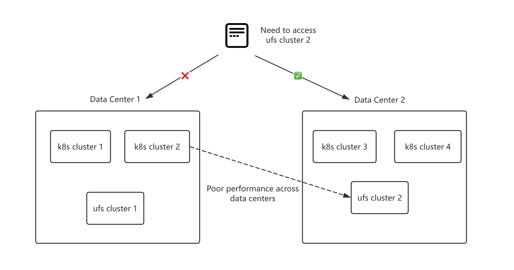
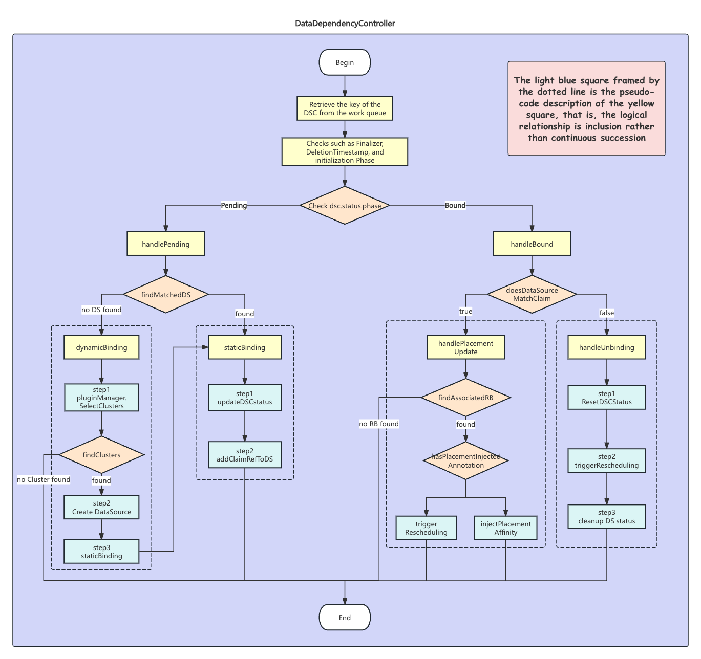

# Data Aware Dependency Scheduling for Volcano Global
## Motivation

### 1. Context and Pain Points

Volcano Global, as a multi-cluster scheduling platform in the community, already provides robust capabilities for cross-cluster CPU and Memory resource scheduling, supporting advanced features like priority queues scheduling. However, in High-Performance Computing (HPC) scenarios such as AI training and Big Data analysis, task execution depends heavily on **Data Resources**, not just compute resources.

Currently, Volcano Global lacks support for scheduling constraints based on "Data Locality." In a multi-cluster environment, this limitation implies that the scheduler might dispatch tasks to clusters physically distant from their data sources. This not only results in prohibitive cross-region bandwidth costs and high I/O latency but also forces operators to manually maintain complex, static "Task-to-Cluster" mapping rules. As data scales, this manual intervention becomes highly inefficient and prone to causing cluster load imbalance.

### 2. Problem Analysis: The Relationship Between Data and Clusters

To address these pain points, we must first clarify the relationship between "data" and "compute clusters" in modern architectures.

Initially, there was a misconception that data resides directly on the nodes of a compute cluster (similar to local storage). However, in large-scale production environments, this assumption is invalid. The real challenge we face is not simple "Node-Level Affinity," but rather complex **"Topological Affinity under Compute-Storage Disaggregation."**

The core question we must answer is: **When data resides in external storage systems (e.g., HDFS, S3, Iceberg) rather than inside the Kubernetes cluster, how does the system determine which compute cluster is the "optimal" placement?**


### 3. Technical Facts and Requirement Clarification

Through in-depth analysis of real-world business scenarios (specifically involving the **Amoro** data lake management platform), we have identified the following key technical facts:

- **Compute-Storage Disaggregation:** Compute tasks run within Kubernetes clusters, while actual data files are stored in a unified Distributed File System (UFS, e.g., HDFS/S3). Compute resources and storage resources are physically separated.
    
- **Cross-Region Bottlenecks:** Although all compute clusters can theoretically access the UFS via the network, **physical distance** dictates performance. Compute clusters are usually deployed in the same Data Center (DC) or Region as specific storage clusters. Cross-DC or Cross-Region data access incurs severe bandwidth bottlenecks and high latency.
    
- **Metadata-Driven Management:** Users typically manage data via platforms like **Amoro**, which maintains metadata mapping from "Logical Tables" to "Physical Storage Locations."
    
- **The Operational Gap:** Developers focus on business logic (e.g., "I depend on db.user_table") without knowledge of the underlying storage topology. Meanwhile, operators cannot monitor the data requirements of every task in real-time. Manual labeling approaches cannot keep pace with dynamic data migration and explosive data growth.

### 4. Conclusion: The Proposed Approach

Based on the analysis above, relying solely on static configurations or native Kubernetes mechanisms is insufficient. We propose building a pluggable **Data-Aware Scheduling Framework**.

The core of this framework lies in **introducing a dedicated Data Dependency Controller to bridge the gap between logical data and physical resources.** By utilizing external dependency detection plugins, the controller acts as an intermediary, querying **Amoro** (or other metadata centers) for real-time physical data distribution. It then translates this information into topology constraints that the scheduler can recognize. This design not only decouples the scheduling core from external storage systems but also achieves a fully automated "Compute-to-Data" (Data Gravity) workflow without manual intervention.

## Design Philosophy

Having established the motivation for data-aware scheduling, the design phase focuses on two critical questions: **How do we bridge the gap between logical data and physical clusters?** and **How do we introduce external dependencies without compromising scheduler performance?**

### 1. Core Mechanism: The Translation Layer (Logical to Physical)

Our primary design principle is **"Decoupling Logical from Physical."**

- **The Necessity of API Access:**  
    From a user's perspective, data is a logical object (e.g., catalog.db.table), which typically carries business semantics or permission boundaries. However, the scheduler cares about physical objects (e.g., s3://warehouse-bucket/), which directly dictate network bandwidth and latency.  
    In modern data lake architectures like Amoro/Iceberg, **a complex many-to-many relationship exists between Logical Catalogs and Physical Warehouses.** Multiple logical catalogs may point to the same physical storage bucket, while individual tables within a single catalog can be overridden to reside in different locations. Consequently, relying solely on static mapping based on Catalog names is unreliable.
    
- **Two-Phase Resolution Strategy:**  
    To bridge this gap, we designed a "Two-Phase Resolution" mechanism:
    
    1. **Dynamic Resolution:** The system queries the Amoro API to resolve the user-declared logical table name (catalog.namespace.table) into the actual metadata storage path (metadata-location).
        
    2. **Static Mapping:** Using the resolved physical path, the system applies a pre-configured Location-to-Cluster topology mapping (via ConfigMap) to deduce the physical data center or cluster set where the data resides.
        
    
    This approach allows developers to remain agnostic to the underlying storage topology and enables operators to adjust storage architecture flexibly, with the system automatically handling the intermediate "translation."
    

### 2. Architectural Decision: Separation of Concerns

**Merely attaching an Amoro query plugin to the scheduler is insufficient.**

Embedding external HTTP API calls directly into the Scheduler's core scheduling loop would introduce severe performance and stability risks:

- **Performance Bottlenecks:** Network latency from external APIs would directly block the scheduling queue, drastically reducing the overall cluster scheduling throughput.
    
- **Stability Risks:** Jitter or unavailability (e.g., Timeouts/503 errors) of the external service could cause the scheduler to crash or become unresponsive.
    
- **Resource Waste:** If thousands of Pods depend on the same table, it is highly inefficient for the scheduler to initiate thousands of identical queries.
    

Therefore, our design philosophy is to **offload "Dependency Resolution" (Heavy Lifting) from "Scheduling Decision" (Decision Making).** We introduce a dedicated **DataDependencyController** to handle time-consuming API queries asynchronously in the **Control Plane**.

### 3. State Abstraction: CRD-Based Caching and Reuse

To implement the aforementioned asynchronous processing and state management, we adopt the standard Kubernetes Operator pattern with a two-level CRD abstraction:

- **DataSourceClaim (DSC) — The Intent:**  
    Represents a specific data requirement from a user (e.g., "I need to access Table A"). It is lightweight and follows the lifecycle of the Pod.
    
- **DataSource (DS) — The Cache:**  
    This is a critical design abstraction. **The DataSource does not represent a physical storage device, but rather a "System-level Cache of the API Resolution Result."**
    

**Workflow and Efficiency:**  
When the DataDependencyController detects a new DSC, it first checks if a corresponding DS exists in the cluster:

- **Cache Hit:** If a valid DS exists, the controller directly reuses the existing topology information without making an API call.
    
- **Cache Miss:** Only when the DS is absent does the controller query Amoro and create a new DS, which is then available for reuse by all subsequent DSCs referencing the same table.
    

This design ensures that the frequency of external API access is decoupled from the number of workloads, significantly enhancing system efficiency and scalability.
## API Design

To achieve declarative management and logical decoupling for data-aware scheduling, we introduce two core Custom Resource Definitions (CRDs): `DataSourceClaim` and `DataSource`. This design adopts a **"Declaration - Cache"** layered pattern: the former represents the user's "requirement declaration," and the latter represents the system's **"metadata cache."**

#### 1. DataSourceClaim: The User Intent
`DataSourceClaim` (DSC) is a **Namespace-scoped** resource submitted by users (developers) to declare workload dependencies on specific data.

**Design Highlights:**
*   **Precise Workload Association (Workload Reference):** We introduce the `WorkloadRef` field. This allows the DataDependencyController to use a Dynamic Client to precisely locate the target Job/Deployment and inject scheduling constraints directly, eliminating the need for complex and error-prone label selectors.
*   **Universal Addressing Coordinates:** External data sources are uniquely identified via a `System`, `Type`, and `Name` triplet. This structure supports extensibility for various data systems (e.g., Amoro, Hive, S3).

```go
// DataSourceClaimSpec defines the desired state of DataSourceClaim.
type DataSourceClaimSpec struct {
	// System specifies the underlying data system (e.g., "amoro", "hive").
	// +required
	System string `json:"system"`

	// DataSourceType specifies the category within the system (e.g., "table", "directory").
	// +required
	DataSourceType string `json:"dataSourceType"`

	// DataSourceName specifies the logical name (e.g., "catalog.db.table").
	// This serves as the key for the plugin to lookup metadata.
	// +required
	DataSourceName string `json:"dataSourceName"`

	// Workload specifies the target workload associated with this claim.
	// This enables the controller to precisely inject scheduling constraints.
	// +required
	Workload WorkloadRef `json:"workload"`

	// Attributes provides extra metadata (e.g., access mode, specific snapshot ID).
	// +optional
	Attributes map[string]string `json:"attributes,omitempty"`
}
```

### 2. DataSource: The System Cache
`DataSource` (DS) is a **Cluster-scoped** resource automatically created by the Controller. **It acts strictly as a metadata cache object**, storing the results queried and resolved from external metadata centers (e.g., Amoro).

**Design Highlights:**
*   **As a Cache Layer:** The core value of the DS lies in minimizing external API calls. Multiple jobs across different namespaces depending on the same table will directly read from the same DS object, significantly boosting system efficiency.
*   **Locality Storage:** The `Locality` field stores the resolved result indicating which clusters hold the data. **The DataDependencyController reads this field** to generate corresponding scheduling constraints (Affinity) and applies them to the workload. The scheduler does not read this object directly.
*   **Retention Strategy:** The lifecycle is defined via the `ReclaimPolicy` field. In our design, **we prioritize the `Retain` policy**, meaning the DS object is preserved even when no jobs reference it. This allows future jobs to reuse the cache immediately, maximizing the cache hit rate and minimizing external I/O overhead.

```go
// DataSourceSpec defines the desired state of DataSource.
type DataSourceSpec struct {
	// ... (System, Type, Name fields identifying the source)

	// Locality defines the resolved physical location of the data.
	// Used by the controller to generate scheduling constraints.
	// +required
	Locality *DataSourceLocality `json:"locality"`

	// ReclaimPolicy defines what happens when the last bound DSC is deleted.
	// Defaults to "Retain" to maximize cache hit rate.
	// +optional
	ReclaimPolicy DataSourceReclaimPolicy `json:"reclaimPolicy,omitempty"`
}

// DataSourceLocality specifies the cached location information.
type DataSourceLocality struct {
	// ClusterNames is a list of cluster names where the cached data source information indicates availability.
	// +required
	ClusterNames []string `json:"clusterNames"`
}
```

### 3. Status & Observability
The controller maintains object states via the Status field, primarily for **System Observability**.

*   **DSC Status:** Records the `Phase` (Pending/Bound) and the bound `BoundDataSource` name. A `Bound` phase indicates that data location resolution is complete.
*   **DS Status:** Records `ClaimRefs` (a list of all DSCs referencing this DS) and `BoundClaims` (the total count). **This provides administrators with a clear "Data Heatmap" view**, helping operators understand which data tables are frequently accessed by which workloads.

```go
// DataSourceStatus defines the observed state of DataSource.
type DataSourceStatus struct {
	// ClaimRefs tracks all DSCs utilizing this DataSource.
	// Provides observability into which workloads are using this data cache.
	// +optional
	ClaimRefs []corev1.ObjectReference `json:"claimRefs,omitempty"`

	// BoundClaims is the count of active claims.
	// +optional
	BoundClaims int32 `json:"boundClaims,omitempty"`

    // ... Conditions
}

// DataSourceClaimStatus defines the observed state of DataSourceClaim.
type DataSourceClaimStatus struct {
	// Phase indicates if the claim has been resolved and bound.
	// +default="Pending"
	Phase DSCPhase `json:"phase"`

	// BoundDataSource points to the specific DataSource object providing locality info.
	// +optional
	BoundDataSource string `json:"boundDataSource,omitempty"`
}
```
## Architecture & Workflow

### 1. Architectural Overview
The core component of this framework is the **DataDependencyController**. Operating on the control plane, it serves as the bridge between user logical requirements (`DataSourceClaim`) and physical scheduling decisions (Karmada Scheduler).

*   **Inputs:** User-submitted `DataSourceClaim` (DSC) and external metadata from the data lake (e.g., Amoro).
*   **Intermediate State:** The `DataSource` (DS) object maintained within the cluster, acting as a metadata cache.
*   **Outputs:** Modifications to Karmada's `ResourceBinding` (RB), specifically the injection of `ClusterAffinity` constraints.


### 2. Controller State Machine Logic
The core logic of the DataDependencyController is built around a rigorous state machine based on the `DataSourceClaim.Status.Phase` field. As illustrated in the workflow diagram, the Reconcile Loop is divided into two primary branches: **Pending (Discovery & Binding)** and **Bound (Maintenance & Injection)**.

**(1) Handle Pending: Discovery & Binding**
When a DSC is in the `Pending` state, the controller's goal is to resolve data location and establish a binding.
*   **Cache Lookup Strategy:** The controller first attempts to find a matching `DataSource` (DS) within the cluster.
    *   **Cache Hit:** If a match is found, the controller reuses the existing DS and proceeds directly to static binding. This achieves **O(1)** reuse efficiency.
    *   **Cache Miss:** If not found, **Dynamic Binding** is triggered.
*   **Dynamic Binding:**
    1.  The Plugin Manager queries the Amoro API.
    2.  The returned `metadata-location` is parsed and mapped to a Cluster List using the ConfigMap.
    3.  **Create DataSource:** A new DS object (protected by a Finalizer) is created and persisted in the cluster.
*   **Static Binding:** The controller atomically updates the DSC's `BoundDataSource` field and increments the DS's `ClaimRefs` counter.

**(2) Handle Bound: Injection & Correction**
When a DSC is in the `Bound` state, the controller applies topology constraints to the workload and monitors state consistency.
*   **Consistency Verification:** Every reconciliation begins by verifying if the DSC still matches the bound DS (`doesDataSourceMatchClaim`).
    *   If the user modifies the logical table name in the DSC, or if the DS is marked for deletion, this check fails, triggering the **Unbinding** process.
*   **Affinity Injection:**
    *   The controller locates the Karmada `ResourceBinding` (RB) associated with the DSC.
    *   **Gatekeeping Mechanism:** It checks if the RB has already been processed. If not, the controller translates the `Locality` info from the DS into `ClusterAffinity`, injects it into the RB, and adds an Annotation to prevent duplicate processing. This ensures scheduling constraints are applied before the Karmada Scheduler finalizes placement.
*   **Unbinding & Rescheduling:**
    *   Upon detecting an invalid binding, the controller resets the DSC status to `Pending`.
    *   It cleans up affinity rules in the RB and triggers **Rescheduling** in Karmada, ensuring the workload is not scheduled to an incorrect location.

### 3. Lifecycle Management
To ensure system robustness under concurrency and edge cases, we have designed a strict lifecycle management process for both `DataSourceClaim` (DSC) and `DataSource` (DS). The following flows detail how specific operations trigger different branches of the controller logic.

**A. DSC Lifecycle**

**1. DSC Creation (Creation & Gatekeeping)**
*   **Scenario:** A user submits a DSC, followed by the creation of a workload (e.g., Deployment).
*   **Flow:**
    1.  **Pending Phase:** The controller initializes the DSC as `Pending` and enters the `handlePending` branch.
    2.  **Binding:** Executes `findMatchedDS`.
        *   **Cache Miss:** Enters `dynamicBinding` -> Queries Plugin -> **Creates DS** -> `staticBinding`.
        *   **Cache Hit:** Directly enters `staticBinding`.
    3.  **State Transition:** Upon successful binding, the DSC status changes to `Bound`.
    4.  **Gatekeeping:** Karmada creates a `ResourceBinding` (RB) for the workload. The controller captures this event, re-queues the DSC, enters `handleBound` -> `handlePlacementUpdate`, and executes `injectPlacementAffinity` to apply scheduling constraints.

**2. DSC Modification**
Modifications are handled differently depending on the changed field:

*   **Case I: Workload Reference Update**
    *   *Scenario:* The user modifies the DSC to point to a different Deployment, but the data source remains the same.
    *   *Flow:* Enters `handleBound` branch.
    *   *Check:* `doesDataSourceMatchClaim` returns **True** (Data source unchanged).
    *   *Action:* Enters `handlePlacementUpdate`. The controller detects the new workload's RB and executes `injectPlacementAffinity`.

*   **Case II: Data Source Reference Update**
    *   *Scenario:* The user changes the dependency from Table A to Table B.
    *   *Flow:* Enters `handleBound` branch.
    *   *Check:* `doesDataSourceMatchClaim` returns **False** (Name mismatch).
    *   *Action:* Enters **`handleUnbinding`** branch.
        1.  **Step 1:** `ResetDSCStatus` resets DSC to `Pending`.
        2.  **Step 2:** `triggerRescheduling` cleans up the old RB's affinity rules.
        3.  **Step 3:** `cleanup DS status` decrements the old DS's reference count.
    *   *Result:* The next reconciliation will re-enter `handlePending` to find a binding for Table B.

**3. DSC Deletion**
*   **Scenario:** The user deletes the DSC.
*   **Flow:** The controller detects that `DeletionTimestamp` is set.
*   **Action:**
    1.  Executes cleanup logic: Decrements the `ClaimRefs` counter of the bound DS.
    2.  **Remove Finalizer:** Only after successful cleanup does the controller remove the DSC's Finalizer, allowing the API Server to physically delete the object.

**B. DS Lifecycle**

**1. DS Creation**
*   **Trigger:** Initiated during the `dynamicBinding` process of a DSC.
*   **Key Point:** The DS is injected with a **Finalizer** immediately upon creation, ensuring the cached metadata is protected until no DSCs reference it.

**2. DS Update / Data Migration (Auto-Update & Self-Healing)**
*   **Scenario:** Underlying data migrates (e.g., Amoro Rebalance), and the plugin detects a change, updating the DS's `Locality`.
*   **Flow:**
    1.  **Trigger:** The DS update event re-queues all associated DSCs.
    2.  **Maintenance:** DSC enters `handleBound`. `doesDataSourceMatchClaim` still returns **True**.
    3.  **Action:** Enters `handlePlacementUpdate` -> `findAssociatedRB`.
    4.  **Rescheduling:** The controller detects a discrepancy between the DS `Locality` and the RB's current Affinity. It executes `triggerRescheduling`, updating the RB constraints to force Karmada to move the workload, implementing **"Compute Follows Data."**

**3. DS Deletion (Manual Deletion & Safety)**
*   **Scenario:** An operator manually executes `kubectl delete ds`.
*   **Flow:**
    1.  **Interception:** The controller observes the DS `DeletionTimestamp`. The `updateDataSource` handler re-queues all associated DSCs.
    2.  **Forced Unbinding:** DSC enters the `handleBound` branch. `doesDataSourceMatchClaim` contains a special check: **If the DS is being deleted, it is considered a mismatch**, returning **False**.
    3.  **Unbinding Execution:** The DSC is forced into the `handleUnbinding` branch, performing unbinding and RB cleanup.
    4.  **Hard Deletion:** When the last associated DSC completes unbinding (`removeClaimRefFromDS`), the controller detects that the DS reference count is zero and the DS is marked for deletion. It then removes the DS Finalizer, completing the physical deletion.

