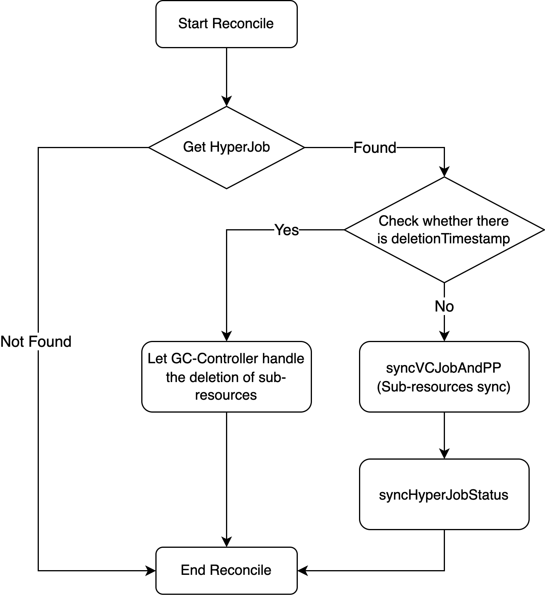
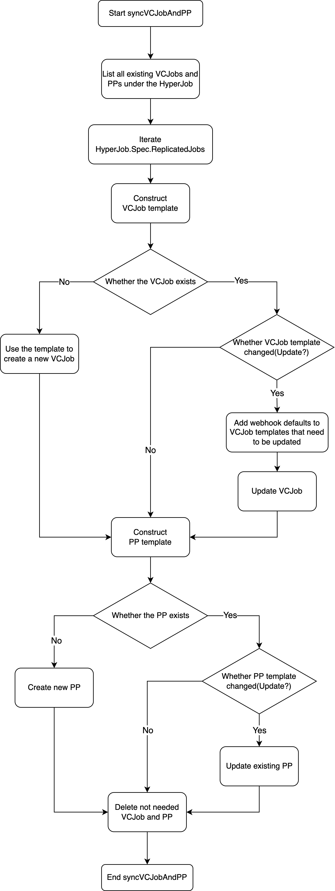
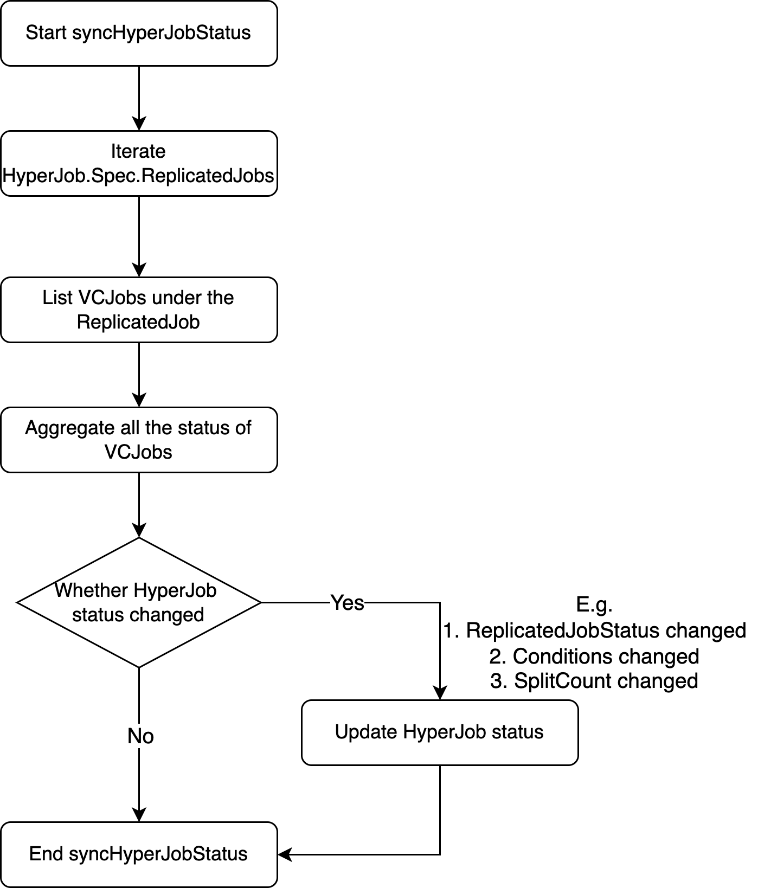

# HyperJob Controller Implementation

@JesseStutler; Jan 15, 2026

## Introduction

This document describes the implementation of the HyperJob controller in volcano-global. The controller manages the lifecycle of multiple Volcano Jobs (VCJobs) and their corresponding PropagationPolicies based on a single HyperJob resource.

For HyperJob API design, motivation, and use cases, refer to the [HyperJob API proposal](https://github.com/volcano-sh/volcano/blob/master/docs/design/hyperjob-multi-cluster-job-splitting.md) in the main Volcano repository.

## Controller Overview

The HyperJob controller is built on controller-runtime framework and integrated into volcano-global's reconciler framework. It watches HyperJob resources and their owned child resources, triggering reconciliation on any changes.

**Main reconciliation flows:**
- **Reconcile()**: Main reconciliation entry point
- **syncVCJobAndPP()**: Synchronizes child VCJobs and PropagationPolicies
- **syncHyperJobStatus()**: Aggregates status from all child VCJobs

## Reconciliation Flows

### 1. Reconcile()

The main reconciliation function handles the overall workflow:

1. Fetch the HyperJob 
2. If the HyperJob is being deleted (DeletionTimestamp != nil), return immediately (Let gc-controller in kcm do the garbage collection of child resources)
3. Call syncVCJobAndPP() to ensure child resources match the desired state
4. Call syncHyperJobStatus() to aggregate status from all child VCJobs

The image below illustrates the Reconcile workflow:

<div align="center">
  
</div>

### 2. syncVCJobAndPP()

This function synchronizes child VCJobs and PropagationPolicies to match the HyperJob specification:

1. List all existing child VCJobs and PropagationPolicies
2. For each ReplicatedJob:
   - Create VCJob and PropagationPolicy if not exists
   - Update VCJob and PropagationPolicy if spec changed
3. Delete stale child resources that are no longer needed
4. Return the total split count

<div align="center">
  
</div>

### 3. syncHyperJobStatus()

This function aggregates status from all child VCJobs and updates the HyperJob status:

1. Check if HyperJob is already in terminal state, skip if true
2. List all child VCJobs and aggregate their status
3. Construct terminal conditions (Completed or Failed) if all child VCJobs finished
4. Update HyperJob status if changed

<div align="center">
  
</div>

## Resource Management

### Naming Convention

Child resources follow the pattern: `{hyperjob-name}-{replicatedjob-name}-{index}`

Example: HyperJob "llm-training" with ReplicatedJob "trainer" and Replicas=3 creates:
- VCJobs: llm-training-trainer-0, llm-training-trainer-1, llm-training-trainer-2
- PropagationPolicies: llm-training-trainer-0, llm-training-trainer-1, llm-training-trainer-2

### Labels

The controller uses labels to track relationships and detect changes:

| Label | Purpose |
|-------|---------|
| `volcano.sh/hyperjob-name` | Links child resources to parent HyperJob |
| `volcano.sh/replicatedjob-name` | Identifies which ReplicatedJob a VCJob belongs to |
| `volcano.sh/vcjob-template-spec-hash` | SHA256 hash of VCJob template for change detection |
| `volcano.sh/pp-spec-hash` | SHA256 hash of PropagationPolicy spec for change detection |


### PropagationPolicy Generation

For each VCJob, the controller creates a PropagationPolicy to enable Karmada-based multi-cluster distribution.

```yaml
apiVersion: policy.karmada.io/v1alpha1
kind: PropagationPolicy
metadata:
  name: {vcjob-name}
  ownerReferences: [{HyperJob}]
spec:
  propagateDeps: true
  resourceSelectors:
  - apiVersion: batch.volcano.sh/v1alpha1
    kind: Job
    name: {vcjob-name}
  placement:
    replicaScheduling:
      replicaSchedulingType: Divided
      replicaDivisionPreference: Aggregated
    clusterAffinity:  # Optional, from ReplicatedJob.ClusterNames
      clusterNames: [...]
    spreadConstraints:
    - spreadByField: cluster
      minGroups: 1
      maxGroups: 1
```

Key fields:
- `propagateDeps: true` - Propagate dependent resources (ConfigMaps, Secrets)
- `replicaSchedulingType: Divided` - Allow splitting VCJob replicas across clusters
- `replicaDivisionPreference: Aggregated` - Prefer placing replicas in fewer clusters
- `clusterAffinity` - Restrict to specified clusters if provided
- `spreadConstraints` - Ensure VCJob is placed in exactly one cluster

### Conditions

The controller follows Kubernetes Job's condition model. Conditions are set only when all child VCJobs reach terminal states.

**Condition Types:**

| Type | Set When | Description |
|------|----------|-------------|
| Completed | All child VCJobs completed successfully | All jobs finished with phase=Completed |
| Failed | All child VCJobs finished but at least one failed | At least one job has phase=Failed/Aborted/Terminated |

**Behavior:**
- While jobs are running, no condition is set
- Once set, the condition remains stable
- Users can distinguish in-progress jobs (no condition) from finished jobs (has condition)

## Diagrams

### Overall Sequence Diagram

The overall sequence of HyperJob is shown below:
<div align="center">
  
</div>

## References

- [HyperJob API Design](https://github.com/volcano-sh/volcano/blob/master/docs/design/hyperjob-multi-cluster-job-splitting.md)
- [controller-runtime](https://pkg.go.dev/sigs.k8s.io/controller-runtime)
- [Karmada PropagationPolicy](https://karmada.io/docs/userguide/scheduling/resource-propagating)
